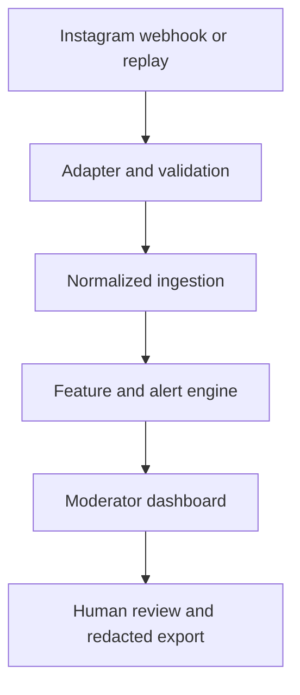

# RaidShield MVP — Codex Build Specification

**Document purpose:** Give this file to Codex as the authoritative build specification for a working, safety-first MVP.

**Working product name:** RaidShield  
**Product type:** Moderator-facing web application  
**Primary platform adapter:** Instagram Professional accounts  
**MVP development window:** Approximately 48 hours  
**Primary users:** Community organizations, community moderators, creators, educators, and public-interest organizations that voluntarily connect an account they own or manage

---

## 1. Instructions to Codex

Read this entire document before modifying the repository. Treat it as the product and engineering source of truth.

### Operating instructions

1. Inspect the repository before making changes. Preserve useful existing work and do not overwrite unrelated user changes.
2. If the repository is empty, scaffold the application described here.
3. Create a short implementation plan before coding and update it as milestones are completed.
4. Work autonomously milestone by milestone. Do not ask the owner questions that can be answered safely by inspecting the repository, reading official documentation, or choosing the simplest reversible implementation.
5. Pause only when:
   - A Meta credential, account action, or app-dashboard action must be performed by the owner.
   - A destructive or irreversible action would be required.
   - A material product decision falls outside this specification.
   - A privacy or safety requirement cannot be met.
6. Never publish, deploy publicly, push to a remote repository, submit a Meta App Review, or interact with a real community account without explicit owner authorization.
7. Do not scrape Instagram or use unofficial Instagram endpoints, browser automation, session cookies, residential proxies, or third-party scraping services.
8. Do not create hateful material for fixtures, prompts, screenshots, or tests. Use neutral tokens, abstract categories, redacted GNCI-provided material, or safe placeholders.
9. Do not upload comment content or personal information to third-party AI services. The MVP must work without an external LLM.
10. Do not infer protected identity, ideology, nationality, religion, ethnicity, gender, sexual orientation, health status, or political beliefs from profiles or content.
11. Do not create a permanent reputation, dangerousness, or hate score for an individual account.
12. Run tests, linting, formatting, type checks, and a production build before declaring a milestone complete.
13. Keep `docs/STATUS.md` current throughout implementation. Record decisions and deviations in `docs/DECISIONS.md`.
14. If an official Meta API detail in this document has changed, verify it against current official Meta documentation, implement the current supported behavior, and record the change in `docs/DECISIONS.md`.

### Definition of success for Codex

The task is complete only when:

- The application runs locally from documented commands.
- The replay/simulation path works without Meta credentials.
- The Instagram webhook verification and ingestion endpoints are implemented.
- A safe fixture can be replayed into the same processing pipeline used by live events.
- The detector distinguishes ordinary activity from a coordinated burst using explainable signals.
- Replies are represented using `parent_id` and appear in the thread visualization.
- Alerts display reasons, contributing signals, confidence, and limitations.
- A human can review and resolve an alert.
- A redacted evidence report can be exported.
- Raw author identifiers are not persisted.
- Raw text is encrypted at rest when persistence is enabled.
- Unit, integration, and end-to-end tests pass.
- The README contains setup, test, demo, privacy, and Meta integration instructions.
- Known limitations and deferred production work are clearly documented.

---

## 2. Product summary

RaidShield is an early-warning and evidence-preservation tool for public comments and replies appearing on posts owned by a participating Instagram Business or Creator account.

The application detects observable patterns that may be consistent with a coordinated pile-on, including:

- Unusual increases in comment or reply volume.
- Multiple first-seen participants arriving within a short interval.
- Repeated or near-duplicate comments.
- Many replies concentrating under one parent comment.
- The same pseudonymous participants appearing across several monitored posts.
- A visible activity burst following content that a human moderator has marked for review.

RaidShield must not claim to know a person’s intent. It must not claim that coordination is necessarily hateful. Its default finding is:

> Possible coordinated activity detected. Human review required.

A higher-priority finding may be shown only when coordination indicators and a separate potential-harm indicator are both present:

> Possible coordinated harmful activity. This is a prioritization signal, not proof of intent or a policy violation.

### Product promise

RaidShield helps a moderator answer four questions quickly:

1. Is activity on this post changing unusually fast?
2. Does the activity appear coordinated rather than independent?
3. Which observable signals caused the alert?
4. What evidence can be safely preserved for human review?

---

## 3. Problem statement

Community moderators frequently see harmful pile-ons after they are already large. Looking at comments one at a time obscures behavioural patterns such as synchronized arrivals, duplication, and concentration within a reply thread. Existing moderation tools often emphasize content classification while giving moderators little explanation of how participation patterns changed.

RaidShield focuses on early, explainable coordination indicators within an account that has voluntarily authorized monitoring. It does not attempt platform-wide surveillance or pre-crime prediction.

---

## 4. Goals and non-goals

### 4.1 MVP goals

- Protect an account that has explicitly opted in.
- Ingest comments and replies from a Meta webhook adapter.
- Support a deterministic JSON replay adapter for development and judging.
- Normalize live and replay events into one event model.
- Reconstruct top-level comment and reply-thread relationships.
- Calculate explainable coordination features over rolling windows.
- Generate review alerts with transparent thresholds.
- Allow a human to label an alert as confirmed activity, benign coordination, uncertain, or dismissed.
- Export a redacted report suitable for internal review.
- Demonstrate privacy-by-design and data minimization.
- Continue working if Meta credentials, App Review, or live webhook delivery are unavailable.

### 4.2 Explicit non-goals

Do not implement any of the following in the MVP:

- Scraping arbitrary Instagram profiles, posts, comments, followers, or following lists.
- Monitoring accounts that have not authorized the application.
- Accessing private accounts, private groups, or direct messages.
- Inferring plans that occurred outside the monitored public comment surface.
- Inferring protected identity or ideology from a biography, username, profile image, or content.
- Enriching commenters through search engines, data brokers, facial recognition, or third-party profile APIs.
- Building an individual-level risk score, watchlist, blacklist, or cross-client identity graph.
- Automatic banning, public accusations, automated reporting, or autonomous comment deletion.
- Training a new hate-speech model on scraped material.
- Generating counterspeech or automatically replying to commenters.
- Legal classification of content.
- Production multi-tenancy, billing, or organization administration.
- Promising detection of private planning before public activity appears.

---

## 5. Users and primary use case

### Primary persona

**Community moderator:** Manages an Instagram professional account for a local community organization. The moderator has limited time, must avoid amplifying harmful material, and needs an explainable alert rather than an opaque model score.

### Primary use case

1. The organization connects an account it owns or manages.
2. RaidShield receives comments and replies on that account’s posts.
3. Several comments arrive rapidly under the same post or parent comment.
4. RaidShield calculates coordination indicators.
5. An alert appears with a timeline, pseudonymous participants, reply structure, duplicate clusters, and reasons.
6. A moderator reviews the alert and marks the outcome.
7. The moderator exports a redacted incident report if preservation or escalation is appropriate.

### Demo use case

1. The presenter opens the Test Lab.
2. The presenter replays an ordinary-discussion fixture.
3. No high-priority alert appears.
4. The presenter replays a coordinated-reply-burst fixture containing only safe placeholders.
5. RaidShield creates an alert and explains the contributing signals.
6. The presenter opens the thread view, performs human review, and exports a redacted report.

---

## 6. Ethical product requirements

These are blocking requirements, not optional polish.

### 6.1 Behaviour, not identity

- Assess event-level and group-level behaviour within the protected account.
- Do not infer personal attributes.
- Do not treat follower count, biography, profile photo, location, or protected identity as evidence of harmful intent.
- Do not create an individual risk score.
- Pseudonymize each source username immediately using keyed HMAC-SHA-256.
- Rotate the HMAC secret between installations so pseudonyms cannot be correlated across deployments.

### 6.2 Separate coordination from harm

Maintain two conceptually separate values:

- `coordination_score`: Derived from timing, duplication, novelty, concentration, and overlap.
- `content_review_score`: Derived only from an authorized local rule, a GNCI-provided annotation, or a human moderator review.

Never label coordination alone as hate.

### 6.3 Human oversight

- All alerts must say “human review required.”
- Do not automatically hide, delete, report, reply to, or ban anything.
- If a future moderation action is implemented, require explicit confirmation and show exactly what will happen.
- Record human outcomes so false alerts can be inspected.

### 6.4 Data minimization

- Do not persist raw usernames.
- Never log tokens, webhook signatures, raw usernames, profile images, biographies, or raw comment content.
- Encrypt persisted comment text using a locally supplied encryption key.
- Allow raw-text persistence to be disabled with `STORE_RAW_TEXT=false`.
- Default retention to 24 hours for raw event content and 30 days for aggregated, pseudonymized metrics.
- Provide a visible “Delete local data” control protected by confirmation.

### 6.5 Safe fixtures

- Test fixtures must use neutral placeholders such as `PATTERN_ALPHA`, `PATTERN_BETA`, and `[GNCI_REDACTED_CATEGORY]`.
- Do not include hateful slurs, threats, dog whistles, personal information, or identifiable screenshots.
- Include a fixture metadata file describing that all content is synthetic or redacted.

---

## 7. Instagram capability boundary

The live adapter is for comments and replies on media owned by an authorized Instagram professional account.

The expected official Meta capabilities include:

- Receiving comment webhook notifications.
- Querying comments on authorized media.
- Reading replies through a comment’s replies edge.
- Receiving or reading fields such as comment ID, text, timestamp, username/from when available, `parent_id`, hidden status, like count, and reply relationships.
- Performing authorized comment moderation actions after human review, although actual mutation actions are out of scope for the MVP.

Important limitations:

- The application does not receive unrestricted access to all public Instagram profiles.
- Business Discovery is limited to professional accounts and must not be used for individual profiling in this MVP.
- A commenter’s public-facing profile is not automatically available merely because the person commented.
- Replies are effectively grouped under a top-level comment; Instagram does not expose a deeply nested Reddit-style hierarchy for all reply-to-reply relationships.
- Development access, live access, and serving accounts not owned by the developer can require different access levels and Meta App Review.

Implementation rule: isolate every Meta-specific assumption inside `InstagramWebhookAdapter` and `MetaGraphClient`. The remainder of the application must depend only on internal normalized types.

---

## 8. Recommended technology stack

Choose boring, well-supported components. Do not add infrastructure that is unnecessary for a single-account MVP.

### Backend

- Python 3.12+
- FastAPI
- Pydantic v2
- SQLAlchemy 2.x
- Alembic
- SQLite for local MVP storage
- `cryptography` for Fernet-compatible field encryption
- scikit-learn for TF-IDF similarity
- NetworkX only if needed for cross-post overlap calculations; omit it if simple sets are sufficient
- pytest, pytest-asyncio, and HTTPX for testing
- Ruff for linting and formatting
- mypy for type checking

### Frontend

- React 18+
- TypeScript
- Vite
- React Router
- TanStack Query
- Recharts for timelines and feature visualization
- Vitest and React Testing Library
- Playwright for one end-to-end demo flow
- ESLint and Prettier

### Packaging and local operations

- Docker Compose for one-command local startup
- Separate backend and frontend development commands
- `.env.example` containing names but no secrets
- A `Makefile` or cross-platform task scripts for setup, test, lint, build, demo seed, and cleanup

### Do not use

- External LLM APIs
- Cloud databases
- Celery, Kafka, Redis, Kubernetes, or microservices
- Unofficial Instagram libraries or scrapers
- A complex authentication provider

For the MVP, a single local administrator token is sufficient for mutation endpoints. The UI may store this token only in memory for the session.

---

## 9. Proposed repository structure

```text
raidshield/
├── AGENTS.md
├── README.md
├── LICENSE
├── .env.example
├── .gitignore
├── docker-compose.yml
├── Makefile
├── backend/
│   ├── pyproject.toml
│   ├── alembic.ini
│   ├── alembic/
│   ├── app/
│   │   ├── main.py
│   │   ├── config.py
│   │   ├── api/
│   │   │   ├── health.py
│   │   │   ├── webhooks.py
│   │   │   ├── replay.py
│   │   │   ├── posts.py
│   │   │   ├── alerts.py
│   │   │   ├── reviews.py
│   │   │   ├── exports.py
│   │   │   └── settings.py
│   │   ├── adapters/
│   │   │   ├── base.py
│   │   │   ├── instagram.py
│   │   │   └── replay.py
│   │   ├── detection/
│   │   │   ├── windows.py
│   │   │   ├── burst.py
│   │   │   ├── similarity.py
│   │   │   ├── synchronization.py
│   │   │   ├── novelty.py
│   │   │   ├── concentration.py
│   │   │   ├── scorer.py
│   │   │   └── explanations.py
│   │   ├── domain/
│   │   │   ├── models.py
│   │   │   ├── enums.py
│   │   │   └── schemas.py
│   │   ├── services/
│   │   │   ├── ingestion.py
│   │   │   ├── alerting.py
│   │   │   ├── review.py
│   │   │   ├── evidence.py
│   │   │   ├── retention.py
│   │   │   └── crypto.py
│   │   └── db/
│   │       ├── session.py
│   │       └── repositories.py
│   └── tests/
│       ├── unit/
│       ├── integration/
│       └── fixtures/
├── frontend/
│   ├── package.json
│   ├── vite.config.ts
│   ├── src/
│   │   ├── api/
│   │   ├── components/
│   │   ├── pages/
│   │   │   ├── DashboardPage.tsx
│   │   │   ├── PostDetailPage.tsx
│   │   │   ├── AlertDetailPage.tsx
│   │   │   ├── TestLabPage.tsx
│   │   │   ├── SettingsPage.tsx
│   │   │   └── SafetyPage.tsx
│   │   ├── types/
│   │   └── test/
│   └── e2e/
├── fixtures/
│   ├── README.md
│   ├── normal_discussion.json
│   ├── coordinated_benign_burst.json
│   ├── coordinated_review_burst.json
│   ├── single_review_comment.json
│   └── reply_thread_burst.json
└── docs/
    ├── STATUS.md
    ├── DECISIONS.md
    ├── ARCHITECTURE.md
    ├── DATA_DICTIONARY.md
    ├── THREAT_MODEL.md
    ├── META_SETUP.md
    ├── DEMO_SCRIPT.md
    └── LIMITATIONS.md
```

If the existing repository uses an equivalent stack, adapt to it instead of needlessly replacing it. Record any significant deviation.

---

## 10. Domain model

### 10.1 Normalized comment event

All input adapters must produce this internal type:

```json
{
  "source": "instagram|replay",
  "source_event_id": "unique-source-event-id",
  "post_id": "source-post-id",
  "comment_id": "source-comment-id",
  "parent_id": "source-parent-comment-id-or-null",
  "author_pseudonym": "hmac-derived-short-id",
  "occurred_at": "2026-08-21T20:35:18Z",
  "received_at": "2026-08-21T20:35:19Z",
  "encrypted_text": "encrypted-or-null",
  "text_fingerprint": "sha256-normalized-text",
  "manual_content_review_score": null,
  "metadata": {
    "is_hidden": false,
    "like_count": 0,
    "fixture_label": null
  }
}
```

Rules:

- `source_event_id` must have a unique database constraint for idempotency.
- Normalize all timestamps to UTC.
- Never store the raw author name or username.
- Derive `author_pseudonym` using `HMAC_SHA256(PSEUDONYMIZATION_KEY, platform + ':' + raw_author_identifier)`.
- Truncate the displayed pseudonym only after storing the full digest.
- Normalize text for fingerprinting by applying Unicode normalization, lowercasing, collapsing whitespace, and removing zero-width characters. Do not aggressively strip punctuation needed for similarity.
- Encrypt text before database insertion if `STORE_RAW_TEXT=true`.

### 10.2 Post

Required fields:

- Internal UUID
- Source platform
- Source post/media ID
- Optional safe display label
- First observed timestamp
- Last event timestamp
- Comment count
- Reply count
- Monitoring status

Do not store or display the original post image in the MVP.

### 10.3 Alert

Required fields:

- Internal UUID
- Post ID
- Optional parent thread ID
- Created timestamp
- Detection-window start and end
- Coordination score
- Content review score, nullable
- Priority: `low`, `medium`, `high`
- Confidence: `low`, `medium`, `high`
- Contributing feature values
- Human-readable explanations
- Event IDs included in the alert
- Status: `new`, `in_review`, `resolved`, `dismissed`
- Resolution: `confirmed_coordination`, `benign_coordination`, `uncertain`, `false_alert`, nullable
- Reviewer note

### 10.4 Human content review

Required fields:

- Alert ID or comment ID
- Review score from 0.0 to 1.0
- Category selected from safe abstract labels provided by the organizer
- Reviewer note
- Review timestamp

Do not pre-populate hateful examples. Categories should describe moderation needs abstractly.

---

## 11. API contracts

All API responses must use consistent JSON error objects and documented status codes. Generate OpenAPI documentation automatically through FastAPI.

### Health

#### `GET /api/v1/health`

Returns application status, database readiness, current mode, and whether Meta credentials are configured. Never return secrets.

### Instagram webhook

#### `GET /webhooks/instagram`

Implements Meta webhook verification:

- Compare `hub.verify_token` with `META_VERIFY_TOKEN` using constant-time comparison.
- Return `hub.challenge` on success.
- Return `403` on failure.

#### `POST /webhooks/instagram`

- Read the raw request body.
- Validate `X-Hub-Signature-256` using `META_APP_SECRET` before parsing or processing.
- Reject missing or invalid signatures with `401`.
- Parse supported comment/reply events.
- Ignore unsupported event types safely and record a sanitized metric.
- Normalize and ingest supported events idempotently.
- Respond quickly; do not perform long analysis synchronously if it threatens webhook response timing.

For the MVP, a FastAPI background task is acceptable. Do not introduce a production queue.

### Replay and test lab

#### `GET /api/v1/fixtures`

Lists bundled safe fixtures and their descriptions.

#### `POST /api/v1/replay`

Request:

```json
{
  "fixture": "reply_thread_burst",
  "speed": 10.0,
  "reset_before_replay": true
}
```

- Requires the local administrator token.
- Sends fixture events through the same ingestion service used by Instagram.
- Supports immediate replay for tests and paced replay for demonstrations.
- Returns replay ID and progress information.

#### `GET /api/v1/replay/{replay_id}`

Returns replay status and processed-event counts.

### Posts and threads

#### `GET /api/v1/posts`

Lists monitored posts with recent volume, alert count, and last event timestamp.

#### `GET /api/v1/posts/{post_id}`

Returns post summary, coordination metrics, and recent alerts.

#### `GET /api/v1/posts/{post_id}/timeline`

Returns bucketed event counts for charting.

#### `GET /api/v1/posts/{post_id}/threads`

Returns top-level comments and pseudonymized reply relationships. Return decrypted text only when raw storage is enabled and an authenticated local administrator requests it.

### Alerts

#### `GET /api/v1/alerts`

Supports filters for status, priority, post ID, and time range.

#### `GET /api/v1/alerts/{alert_id}`

Returns the complete explanation, timeline, feature values, included events, and human-review history.

#### `PATCH /api/v1/alerts/{alert_id}`

Allows status and resolution changes with a reviewer note.

#### `POST /api/v1/alerts/{alert_id}/content-review`

Allows a human reviewer to assign the separate content-review score and safe category.

### Evidence export

#### `POST /api/v1/alerts/{alert_id}/export`

Returns a ZIP containing:

- `incident_report.html`
- `incident_report.json`
- `integrity_manifest.json`
- `README.txt`

The export must omit raw usernames and profile information. Include pseudonyms, timestamps, thread relationships, feature calculations, reviewer decisions, data-source disclosure, known limitations, and SHA-256 hashes for exported files.

### Settings and cleanup

#### `GET /api/v1/settings/detection`

Returns thresholds and window sizes.

#### `PUT /api/v1/settings/detection`

Updates validated settings. Requires administrator token.

#### `POST /api/v1/admin/purge-expired`

Purges records according to retention policy and returns counts only.

#### `DELETE /api/v1/admin/data`

Requires administrator token and an explicit confirmation string. Deletes local application data but leaves fixtures and configuration intact.

---

## 12. Detection design

### 12.1 Design principles

- Prefer deterministic, inspectable features over a complex black-box model.
- Make feature calculations pure functions wherever possible.
- Store the feature values used for every alert so results can be reproduced.
- Never use a profile-derived feature.
- Never convert a coordination score into a claim about motive.
- Require a minimum number of distinct pseudonymous participants before creating a coordination alert.

### 12.2 Rolling windows

Calculate features over:

- 60 seconds
- 2 minutes
- 5 minutes
- 15 minutes

The primary MVP alert window is 2 minutes. Longer windows provide context.

### 12.3 Features

#### A. Burst score `B`

Measure event volume relative to the account/post baseline.

If sufficient history exists:

```text
baseline = median event count across previous comparable 2-minute windows
mad = median absolute deviation
robust_z = (current_count - baseline) / max(1, 1.4826 * mad)
B = clamp(sigmoid(robust_z - 2), 0, 1)
```

If insufficient history exists, use a cold-start threshold:

```text
B = clamp(unique_authors / COLD_START_UNIQUE_AUTHOR_THRESHOLD, 0, 1)
```

Default cold-start threshold: 6 unique authors within 2 minutes.

#### B. Similarity score `S`

- Normalize text safely.
- Build character-level TF-IDF vectors using 3–5 character n-grams.
- Calculate cosine similarity within the current window.
- Form clusters using a default similarity threshold of 0.85.
- `S` is the proportion of events belonging to a cluster of at least 3 events.
- If raw text storage is disabled, calculate and retain the necessary feature values during ingestion, then discard text.

Character n-grams are selected because they tolerate small punctuation and spelling changes without requiring an external embedding service.

#### C. Synchronization score `T`

Calculate median inter-arrival time among unique authors in the active window:

```text
T = 1 - clamp(median_interarrival_seconds / SYNC_REFERENCE_SECONDS, 0, 1)
```

Default `SYNC_REFERENCE_SECONDS`: 30.

Do not allow repeated events from one author to create a high synchronization score by themselves.

#### D. Novelty score `N`

```text
N = first_seen_authors_in_window / unique_authors_in_window
```

“First seen” means not previously observed interacting with this protected account during the configured pseudonymous-metrics retention window. It does not mean a newly created Instagram account.

#### E. Thread concentration score `C`

```text
C = events_in_largest_parent_thread / all_events_in_window
```

This captures replies concentrating under one top-level comment.

#### F. Cross-post overlap `O` — optional MVP feature

Measure the proportion of window participants also observed on another protected post within the previous 24 hours. Implement only after the core detector and tests pass.

### 12.4 Coordination score

Primary MVP formula:

```text
coordination_score =
    0.30 * B +
    0.25 * S +
    0.20 * T +
    0.15 * N +
    0.10 * C
```

Alert defaults:

- Minimum 4 unique authors.
- `medium` coordination alert at score >= 0.70.
- `high` priority only when coordination score >= 0.70 and content-review score >= 0.50.
- If content-review score is absent, never use `high` priority solely because of coordination.

All values must be configurable and validated.

### 12.5 Confidence

Confidence describes data sufficiency, not certainty of malicious intent.

- `low`: Fewer than 6 unique authors or missing timestamps/parent information.
- `medium`: At least 6 unique authors and three feature families available.
- `high`: At least 10 unique authors, all primary feature families available, and the result persists across two adjacent windows.

### 12.6 Alert explanations

Generate explanations from templates tied directly to feature values, for example:

- “Eight unique participants commented within two minutes.”
- “Sixty-five percent of events belong to two near-duplicate clusters.”
- “Seventy-five percent of participants were first observed on this protected account during the alert window.”
- “Most activity was concentrated under one top-level comment.”

Never generate explanations using an external language model.

### 12.7 Alert deduplication

- Do not create a new alert for every event.
- Merge overlapping alerts for the same post/thread when their windows overlap substantially.
- Update the existing alert’s window, score, event set, and explanations.
- Maintain an audit entry for material score changes.

---

## 13. Reply-thread handling

Replies are essential to the MVP.

Requirements:

- Persist `parent_id` for every reply when Meta provides it.
- Treat comments with no `parent_id` as top-level comments.
- Group all replies beneath the relevant top-level parent.
- Do not assume arbitrary-depth nesting.
- If a parent arrives after its reply, accept the reply and repair the relationship when the parent appears.
- If the parent never arrives, show the reply under “Unknown or unavailable parent.”
- Calculate thread concentration using top-level parent groups.
- Show a thread-level activity timeline.
- Display authors using pseudonyms such as `Participant A3F2`, never raw usernames.
- Provide a “content hidden” display when `STORE_RAW_TEXT=false`.

Potential plan indicators must be described as observable signals, such as:

- Action-oriented language identified by an approved local rule.
- Timing references identified by an approved local rule.
- High mention density.
- A burst immediately following a specific parent comment.
- Repeated safe-token patterns across several replies.

Do not state that these signals prove a plan.

---

## 14. Safe fixture specification

Each fixture must follow this structure:

```json
{
  "fixture_name": "reply_thread_burst",
  "description": "Safe synthetic events representing concentrated coordinated replies.",
  "content_origin": "synthetic-safe-placeholder",
  "expected_outcome": {
    "coordination_alert": true,
    "high_priority": false
  },
  "events": []
}
```

Required fixtures:

### `normal_discussion.json`

- At least 25 events across 30 minutes.
- Diverse neutral placeholders.
- Low duplication.
- No alert expected.

### `coordinated_benign_burst.json`

- At least 10 unique authors within 90 seconds.
- Several similar safe-token comments.
- Coordination alert expected.
- Content-review score absent or low.
- Must remain medium priority and be explainable as potentially benign.

### `coordinated_review_burst.json`

- At least 10 unique authors within 90 seconds.
- Uses only `[GNCI_REDACTED_CATEGORY]` or equivalent organizer-provided safe tokens.
- Fixture metadata supplies a content-review score; the text itself does not contain hateful material.
- High-priority review alert expected.

### `single_review_comment.json`

- One organizer-labelled review event.
- No coordination alert expected.
- Demonstrates that one concerning comment is not evidence of coordination.

### `reply_thread_burst.json`

- At least one top-level parent and 12 replies.
- Most activity concentrated under that parent.
- Coordination alert expected.
- Thread visualization must show the relationship.

---

## 15. Frontend requirements

### 15.1 General design

- Calm, professional visual design.
- Avoid alarmist red/black styling.
- Use accessible contrast and keyboard navigation.
- Every score must have an adjacent explanation or tooltip.
- Always display the safety notice: “Signals prioritize human review; they do not prove intent or a policy violation.”
- Never display raw usernames.

### 15.2 Dashboard

Display:

- Current mode: Replay or Instagram.
- Webhook configuration status.
- Last event received.
- Events in the last 15 minutes.
- Active alerts by priority.
- Recent monitored posts.
- Timeline of event volume.
- A visible link to Test Lab.

### 15.3 Post detail

Display:

- Event and unique-participant counts.
- Timeline for 1-, 2-, 5-, and 15-minute views.
- Top-level threads ranked by recent activity.
- Similarity-cluster sizes.
- Current coordination score and feature breakdown.
- Relevant alerts.

### 15.4 Alert detail

Display:

- Priority, status, confidence, and detection window.
- Coordination score and separate content-review score.
- A bar or radar-style feature breakdown; use a bar chart if more accessible.
- Human-readable reasons.
- Event timeline.
- Reply-thread visualization.
- Pseudonymous participant counts.
- Review controls.
- Export button.
- Limitations statement.

### 15.5 Test Lab

Allow the user to:

- Select a fixture.
- Read its safe description and expected outcome.
- Choose immediate or paced playback.
- Reset demo data.
- Start replay.
- Observe progress.
- Navigate directly to the resulting post or alert.

### 15.6 Settings

Allow validated changes to:

- Alert threshold.
- Minimum unique authors.
- Similarity threshold.
- Cold-start threshold.
- Raw-text storage setting.
- Retention periods.

Show defaults and provide “Restore defaults.”

### 15.7 Safety and limitations page

Explain:

- What RaidShield observes.
- What it cannot know.
- Why coordination is not automatically harmful.
- Why profiles and protected characteristics are excluded.
- How long data is retained.
- How to purge local data.
- How fixtures were created.

---

## 16. Security and privacy requirements

### 16.1 Secrets

Required environment variables:

```dotenv
APP_ENV=development
ADMIN_TOKEN=
DATABASE_URL=sqlite:///./data/raidshield.db
PSEUDONYMIZATION_KEY=
DATA_ENCRYPTION_KEY=
STORE_RAW_TEXT=false
RAW_TEXT_RETENTION_HOURS=24
AGGREGATE_RETENTION_DAYS=30
META_VERIFY_TOKEN=
META_APP_SECRET=
META_ACCESS_TOKEN=
META_IG_USER_ID=
META_GRAPH_VERSION=
FRONTEND_ORIGIN=http://localhost:5173
```

Rules:

- Fail safely if a required security key is missing outside test mode.
- Generate development keys through a documented command, not committed defaults.
- Never return keys in health endpoints or logs.
- Add `.env` and database files to `.gitignore`.

### 16.2 Webhook integrity

- Verify Meta’s signature against the raw body using HMAC-SHA-256.
- Use constant-time comparison.
- Reject invalid signatures.
- Unit-test valid, invalid, missing, and modified-body cases.

### 16.3 Authentication

- Require `Authorization: Bearer <ADMIN_TOKEN>` for replay, settings mutations, reviews, exports, and deletion.
- Read-only local dashboard endpoints may be unauthenticated only when bound to localhost.
- Bind development services to localhost by default.
- Document that this is not sufficient authentication for public deployment.

### 16.4 Logging

Logs may include:

- Event type
- Internal IDs
- Processing duration
- Counts
- Sanitized error codes

Logs must not include:

- Raw webhook bodies
- Raw comment text
- Raw usernames or user IDs
- Access tokens
- App secrets
- Encryption keys
- Export contents

### 16.5 Retention

- Implement a deterministic purge service.
- Run it at application startup and through the administrator endpoint.
- For the MVP, document a recommended scheduled command instead of introducing a scheduler.
- Test that expired raw text is removed or the relevant rows are purged according to the selected design.

### 16.6 Evidence integrity

- Sort exported records deterministically.
- Hash each exported file with SHA-256.
- Store hashes in `integrity_manifest.json`.
- Include generation timestamp, application version, data source, and disclosure that the package is not a forensic certification.

---

## 17. Testing requirements

### 17.1 Backend unit tests

Required tests:

- Meta webhook verification succeeds with correct token.
- Webhook verification fails with incorrect token.
- Valid webhook signature is accepted.
- Invalid or missing signature is rejected.
- Supported comment payload normalizes correctly.
- Reply payload preserves `parent_id`.
- Duplicate `source_event_id` is idempotent.
- Username becomes deterministic keyed pseudonym.
- Raw username is absent from database rows and logs.
- Text encryption/decryption round-trip works.
- Text is not persisted when `STORE_RAW_TEXT=false`.
- Burst feature handles cold start.
- Burst feature handles historical baseline.
- Similarity feature detects safe near-duplicate tokens.
- Similarity feature does not group diverse neutral tokens.
- Synchronization ignores repeated events from one author.
- Novelty is scoped to the protected account.
- Concentration groups replies under the top-level parent.
- Coordination score matches the documented formula.
- Fewer than four unique authors cannot create an alert.
- Overlapping alerts merge instead of multiplying.
- Content-review score remains separate from coordination score.
- Evidence export omits raw identity fields.
- Retention purge removes expired data.

### 17.2 Backend integration tests

- Replay fixture passes through adapter, ingestion, detection, persistence, and alert creation.
- `normal_discussion` creates no coordination alert.
- `coordinated_benign_burst` creates a medium coordination alert, not a high-priority harmful-activity alert.
- `coordinated_review_burst` creates a high-priority review alert because both independent conditions are present.
- `single_review_comment` creates no coordination alert.
- `reply_thread_burst` creates an alert with a parent-thread explanation.
- Alert review and resolution persist.
- Export endpoint returns a valid ZIP and manifest.

### 17.3 Frontend tests

- Dashboard renders empty state.
- Dashboard renders replay activity.
- Alert card displays coordination and content-review scores separately.
- Alert detail renders explanations and limitations.
- Reply thread renders parent and children.
- Settings reject invalid thresholds.
- Test Lab launches a fixture replay.

### 17.4 End-to-end test

Implement one Playwright test:

1. Start from a clean database.
2. Open Test Lab.
3. Replay `reply_thread_burst` immediately.
4. Wait for completion.
5. Open the generated alert.
6. Verify the reply-thread explanation and feature breakdown.
7. Mark it `benign_coordination` or `confirmed_coordination`.
8. Export the report.

### 17.5 Quality gates

Before completion, all must pass:

```bash
make lint
make typecheck
make test
make build
make e2e
```

Target at least 80% coverage for `backend/app/detection` and `backend/app/services/ingestion.py`. Do not chase repository-wide coverage at the expense of core correctness.

---

## 18. Milestone execution plan

### Milestone 0 — Repository inspection and plan

Deliverables:

- Repository inspection complete.
- `docs/STATUS.md` created.
- `docs/DECISIONS.md` created.
- Implementation plan written.
- Existing constraints documented.

Acceptance criteria:

- No code changes made before the repository and existing instructions are understood.
- The plan maps directly to the milestones below.

### Milestone 1 — Skeleton and local startup

Deliverables:

- Backend and frontend scaffold.
- Docker Compose.
- Configuration validation.
- Health endpoint.
- Basic dashboard shell.
- Make commands.

Acceptance criteria:

- `make dev` or documented equivalent starts both services.
- Dashboard can reach health endpoint.
- No secrets are committed.

### Milestone 2 — Domain model, storage, and safe replay

Deliverables:

- Database schema and migration.
- Pseudonymization and encryption services.
- Normalized event type.
- Safe fixtures.
- Replay adapter and API.
- Post and thread query endpoints.

Acceptance criteria:

- Replaying a fixture persists normalized events.
- Duplicate replay is idempotent when reset is disabled.
- Raw usernames never reach the database.
- Reply relationships are queryable.

### Milestone 3 — Detection engine

Deliverables:

- Windowing.
- Burst, similarity, synchronization, novelty, and concentration features.
- Coordination scorer.
- Confidence calculation.
- Explanation templates.
- Alert merge logic.

Acceptance criteria:

- Required fixture outcomes pass automated tests.
- Every alert has reproducible feature values and explanations.
- Coordination and content review remain separate.

### Milestone 4 — Moderator dashboard

Deliverables:

- Dashboard.
- Post detail.
- Alert detail.
- Reply thread view.
- Human review flow.
- Test Lab.
- Settings.
- Safety page.

Acceptance criteria:

- The full fixture demo can be completed without API tools or manual database edits.
- All scores are explained.
- UI never shows raw usernames.

### Milestone 5 — Evidence export and retention

Deliverables:

- Redacted HTML and JSON report.
- Integrity manifest.
- ZIP export.
- Retention purge.
- Local-data deletion flow.

Acceptance criteria:

- Export contains no prohibited fields.
- Manifest hashes validate.
- Purge tests pass.

### Milestone 6 — Instagram adapter

Deliverables:

- Webhook verification.
- Signature verification.
- Payload normalization.
- Sanitized error handling.
- `docs/META_SETUP.md`.
- Official sample-payload test.

Acceptance criteria:

- Meta dashboard verification can succeed once the owner supplies credentials and a public HTTPS callback.
- A valid signed sample event enters the same ingestion pipeline as replay events.
- Missing credentials do not prevent replay mode from working.

Owner checkpoint: Ask only for the necessary dashboard actions or credentials. Do not request that secrets be pasted into chat or committed to files. Instruct the owner to place them directly in the local `.env` or secret manager.

### Milestone 7 — Validation and handoff

Deliverables:

- All quality gates pass.
- `README.md` finalized.
- `docs/ARCHITECTURE.md`, `docs/DATA_DICTIONARY.md`, `docs/THREAT_MODEL.md`, `docs/DEMO_SCRIPT.md`, and `docs/LIMITATIONS.md` finalized.
- Final self-review performed.

Acceptance criteria:

- A new developer can run the application from the README.
- Demo succeeds from a clean checkout without Meta credentials.
- Live integration steps are documented but not falsely claimed as completed if credentials were unavailable.
- `docs/STATUS.md` clearly separates completed, partially completed, blocked, and deferred work.

---

## 19. README requirements

The completed README must include:

1. One-paragraph product explanation.
2. A clear safety statement.
3. Screenshot placeholders or locally generated screenshots if available.
4. Architecture summary.
5. Prerequisites.
6. Local setup without Meta credentials.
7. Demo fixture instructions.
8. Test, lint, type-check, and build commands.
9. Environment-variable table.
10. Meta professional-account and webhook setup steps.
11. Explanation of Standard versus production/advanced access without overpromising approval.
12. Data-retention and deletion instructions.
13. Known limitations.
14. AI/tool disclosure stating which tools assisted development.
15. Data and model disclosure stating that no external AI service is required and that fixtures are safe placeholders or organizer-provided redactions.
16. Licence information.

---

## 20. Architecture documentation requirements

Create a concise architecture diagram in `docs/ARCHITECTURE.md` using Mermaid:



Document these boundaries:

- Adapters know source payload formats.
- Domain and detection code never sees raw usernames.
- Detection code is deterministic and side-effect-free where possible.
- Persistence is accessed through repositories.
- Frontend consumes documented APIs only.
- Export generation reads normalized, pseudonymized records.

---

## 21. Threat model requirements

At minimum, `docs/THREAT_MODEL.md` must cover:

| Threat | Required mitigation |
|---|---|
| Forged webhook | Verify HMAC signature on raw body |
| Webhook replay | Unique source-event ID and idempotent ingestion |
| Token leakage | Environment variables, redacted logs, `.gitignore` |
| Username leakage | Immediate HMAC pseudonymization |
| Comment-content exposure | Local encryption, optional non-persistence, retention |
| Cross-community tracking | Installation-specific pseudonymization key |
| False accusation | Behavioural language, explanations, human review |
| Benign campaign flagged | Separate coordination and harm; resolution labels |
| Malicious fixture upload | MVP accepts bundled fixtures only, not arbitrary paths |
| CSV/formula injection | Do not export CSV; escape HTML and JSON safely |
| Stored XSS | React escaping plus server-side validation and safe report templating |
| Denial of service | Request-size limit, pagination, bounded window processing |
| Unauthorized deletion/settings | Administrator token and confirmation |
| Profile surveillance expansion | Explicit architecture and policy prohibition |

---

## 22. Performance targets

For the local MVP on a typical laptop:

- Webhook acknowledgment: under 1 second excluding external network latency.
- Process 1,000 replay events in under 10 seconds in immediate mode.
- Alert creation after a paced event: under 2 seconds.
- Dashboard initial load with 10,000 events: under 3 seconds.
- Evidence export for one alert: under 5 seconds.

Use indexes on source event ID, post ID, occurred timestamp, parent ID, pseudonym, and alert status. Paginate event-heavy endpoints.

---

## 23. Demo evaluation plan

### Quantitative checks

Run all fixtures and report:

- Expected versus actual alert outcome.
- Time to alert.
- Coordination score.
- Priority.
- Number of unique participants.
- Largest similarity cluster.
- Largest reply-thread concentration.
- Whether an unwanted high-priority alert occurred.

### Required comparison

Demonstrate that:

- Normal discussion is not flagged.
- Coordinated benign activity may be flagged for awareness but is not classified as hate.
- One organizer-labelled concerning comment is not treated as coordination.
- Coordinated activity plus independent human/organizer review produces a prioritized alert.

### Demo narrative

The presenter should be able to say:

> RaidShield does not decide who is hateful. It detects explainable changes in how a protected account is being engaged, reconstructs reply patterns, and helps a human moderator review and preserve evidence safely.

---

## 24. Production follow-ups, not part of the MVP

Document but do not implement unless all MVP milestones pass early:

- Meta OAuth onboarding for multiple organizations.
- Advanced Access and App Review preparation.
- Real role-based access control.
- PostgreSQL and managed migrations.
- Secure background job queue.
- Organization-level data isolation.
- Key rotation and managed secrets.
- Moderator notification channels.
- Human-reviewed, multilingual content-assistance models.
- Formal fairness and false-positive evaluation.
- Community advisory-board review.
- Accessible PDF evidence reports.
- Independent security assessment.
- Incident-response procedures.
- Data-processing agreements and jurisdiction-specific privacy review.

---

## 25. Final Codex handoff format

At the end of implementation, Codex must report:

### Completed

- Milestones completed.
- Main user flows implemented.
- Tests and quality checks run, with results.

### How to run

- Exact setup command.
- Exact development command.
- Exact fixture demo command or UI path.
- Exact full validation command.

### Owner actions required

- Any Meta dashboard steps.
- Environment variables that the owner must populate locally.
- Any optional deployment decisions.

### Known limitations

- Missing or partial functionality.
- Unverified live integration details.
- Safety or scale limitations.

### Review guide

- Five to ten files that deserve the owner’s attention.
- Any security-sensitive implementation.
- Any threshold or product decision the owner may want to change.

Do not say that the system detects hate, proves coordination, or predicts planned attacks. Describe precisely what was built and tested.

---

## 26. Suggested initial prompt to accompany this file

Give Codex this repository and this instruction:

> Read `RaidShield_MVP_Build_Spec.md` completely and implement the MVP described there. Treat the file as the source of truth. Inspect the repository first, create and maintain `docs/STATUS.md` and `docs/DECISIONS.md`, and proceed autonomously milestone by milestone. Build the replay path first so the application remains demonstrable without Meta credentials. Do not scrape Instagram, create hateful test material, call external AI services, profile individuals, deploy publicly, or perform autonomous moderation. Run all required validations before handoff. Pause only for the explicit owner checkpoints or a genuine safety/permission blocker.

---

## 27. Authoritative references

Codex must prefer current official documentation over blogs or unofficial examples.

### Meta Instagram Platform

- Instagram Platform overview: <https://developers.facebook.com/documentation/instagram-platform/overview>
- Create an Instagram app: <https://developers.facebook.com/documentation/instagram-platform/create-an-instagram-app>
- Comment moderation: <https://developers.facebook.com/documentation/instagram-platform/comment-moderation>
- Comments edge: <https://developers.facebook.com/documentation/instagram-platform/instagram-graph-api/reference/ig-media/comments>
- IG Comment reference: <https://developers.facebook.com/documentation/instagram-platform/instagram-graph-api/reference/ig-comment>
- Comment replies: <https://developers.facebook.com/documentation/instagram-platform/instagram-graph-api/reference/ig-comment/replies>
- Webhook setup: <https://developers.facebook.com/documentation/instagram-platform/webhooks>
- Webhook payload examples: <https://developers.facebook.com/documentation/instagram-platform/webhooks/examples>
- App Review: <https://developers.facebook.com/documentation/instagram-platform/app-review>
- Business Discovery: <https://developers.facebook.com/documentation/instagram-platform/instagram-api-with-facebook-login/business-discovery>
- User Profile API and consent boundary: <https://developers.facebook.com/documentation/business-messaging/instagram-messaging/features/user-profile>

### Evidence, AI risk, and community safety

- OHCHR Berkeley Protocol on Digital Open Source Investigations: <https://www.ohchr.org/en/publications/policy-and-methodological-publications/berkeley-protocol-digital-open-source>
- WITNESS guidance on retaining original media and metadata: <https://archiving.witness.org/archive-guide/transfer/offloading-cameras/>
- eSafety Commissioner evidence-collection guidance: <https://www.esafety.gov.au/report/how-to-collect-evidence>
- NIST AI Risk Management Framework: <https://www.nist.gov/itl/ai-risk-management-framework>
- UNESCO countering hate speech resources: <https://www.unesco.org/en/countering-hate-speech>

### Codex execution guidance

- OpenAI Codex best practices: <https://learn.chatgpt.com/guides/best-practices>
- Codex `AGENTS.md` guidance: <https://developers.openai.com/codex/agent-configuration/agents-md>

---

## 28. Final safety statement

RaidShield is a moderator decision-support prototype. It detects observable coordination indicators within an authorized comment surface. It does not determine intent, identify protected characteristics, establish that a person or group is hateful, or provide a legal conclusion. All meaningful actions require human review.

