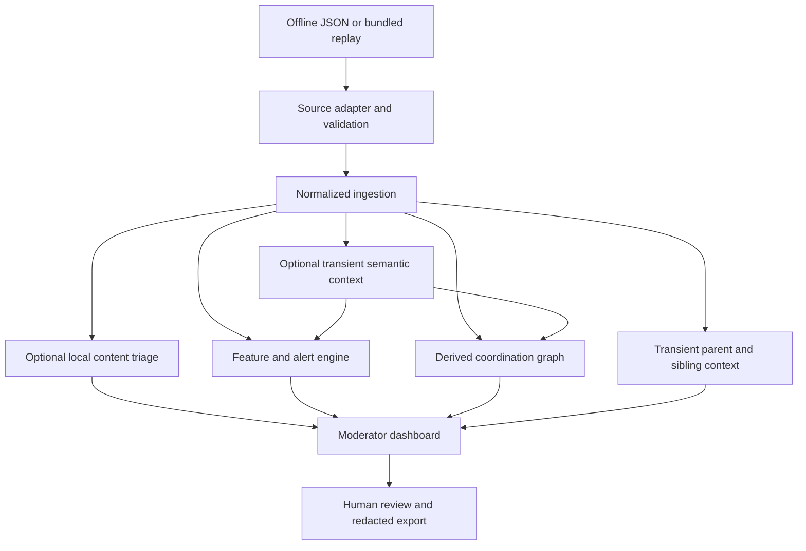

# Architecture

- Adapters alone know source payload formats. Both emit the same validated input schema.
- Raw participant identifiers exist only at the adapter-to-ingestion call boundary and are immediately replaced by installation-keyed HMAC digests. Uploaded filenames and bodies are not retained.
- Detection operates on normalized, pseudonymous event data. Core features are deterministic; optional semantic-context evidence is clearly marked experimental.
- The post-scoped coordination graph is derived on request. Graph-local node IDs and shortened labels prevent full stored pseudonyms from reaching the browser. Without semantic evidence, edges use the original exact-text/timing/shared-target weights. When semantic context is available, the weights become exact text 25%, semantic context 30%, timing 30%, and shared target 15%; semantic similarity requires another behavioral signal. Connected components become visual clusters. Dragged/pinned coordinates and pan/zoom state exist only in React memory and never flow back into detection or persistence.
- A shared reply-context service runs for offline and replay adapters before ingestion. It compares each reply with its direct parent and all siblings, passes parent/reply text transiently to the optional local model, and persists only structural measurements and safe experimental relationship scores. Context never changes coordination or content priority.
- When explicitly enabled, the pinned local NLI adapter examines eligible text transiently and persists only safe label scores, model provenance, and status. It never changes coordination features. Built-in safe replay fixtures are ineligible unless explicitly authorized by an organizer.
- Thread responses expose model evidence through a strict field allowlist. The UI combines those safe scores with text already governed by administrator/encryption controls and deterministic reply measurements; its template explanation reports the ranking/threshold comparison without inventing model reasoning.
- The optional pinned multilingual sentence encoder processes `parent + reply` inputs in memory with safetensors and local-files-only loading. Pairing is limited by post, different participant, matching top-level/reply role, and timing. Embeddings and plaintext are discarded; only hashed internal event references, similarity rankings, timing, and shared-parent facts persist. Public APIs aggregate those records without exposing references.
- SQLAlchemy repositories and short service transactions isolate SQLite persistence.
- The React frontend uses documented JSON APIs only. Mutation endpoints require the local administrator bearer token.
- Export reads normalized records, displays shortened pseudonyms, escapes report text, and includes deterministic SHA-256 hashes.

Offline import and immediate replay are synchronous for reproducibility. Paced replay uses a FastAPI background task. A durable queue is a production follow-up.
