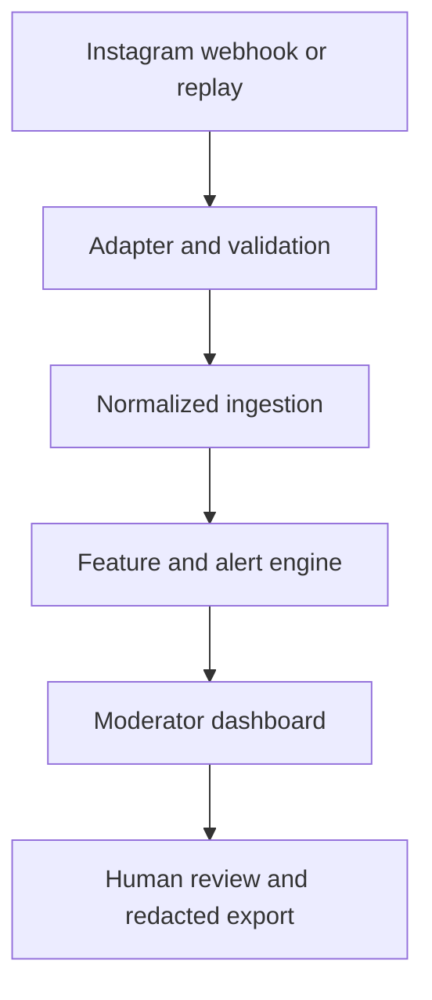

# Architecture

- Adapters alone know source payload formats. Both emit the same validated input schema.
- Raw author identifiers exist only at the adapter-to-ingestion call boundary and are immediately replaced by installation-keyed HMAC digests.
- Detection operates on normalized, pseudonymous event data and deterministic pure feature functions.
- SQLAlchemy repositories and short service transactions isolate SQLite persistence.
- The React frontend uses documented JSON APIs only. Mutation endpoints require the local administrator bearer token.
- Export reads normalized records, displays shortened pseudonyms, escapes report text, and includes deterministic SHA-256 hashes.

The immediate replay path is synchronous for reproducibility. Paced replay and webhook ingestion use FastAPI background tasks. A durable queue is a production follow-up.

